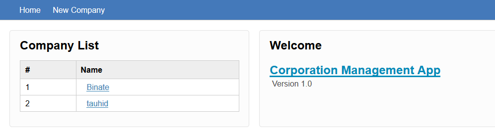
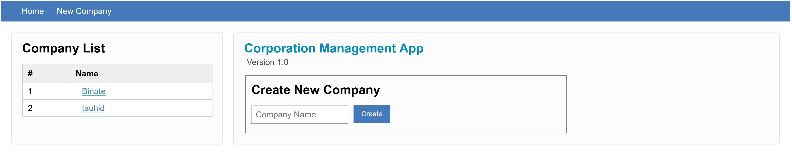
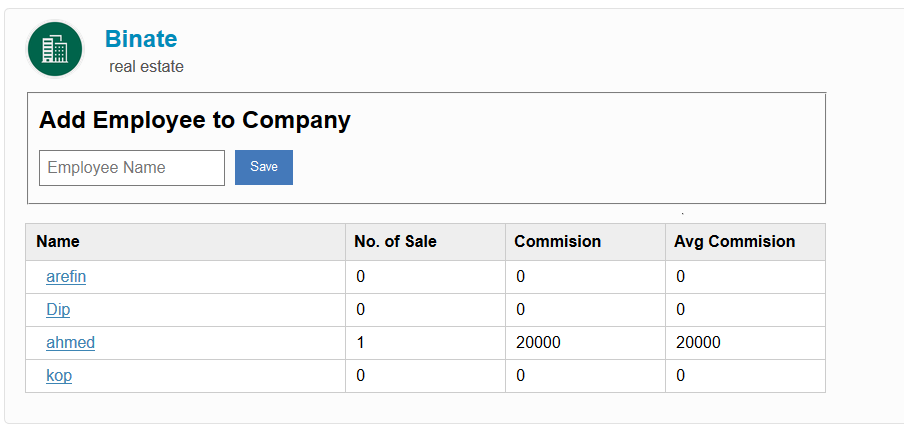
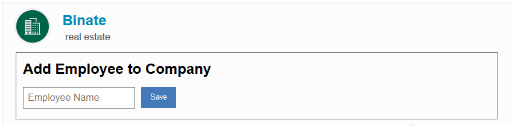
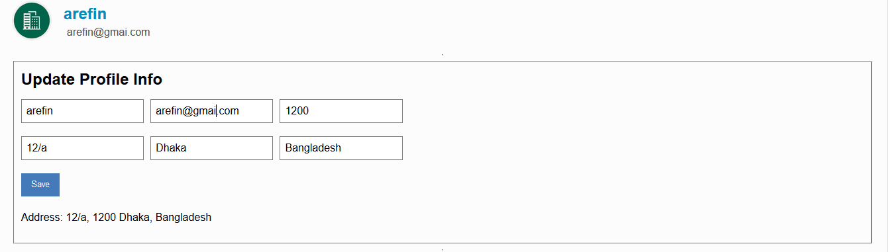
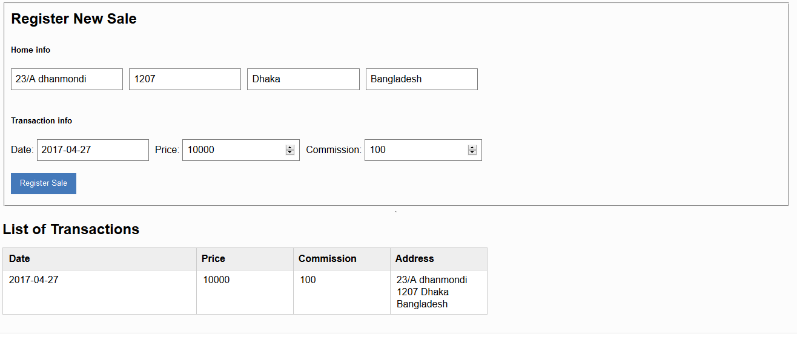

# Corporation Management App
Version 1.0

Features
=========

Simple Corporation Management App using Starcounter. Features include:

- Add new Corporation
- Add new Employee to the Corporation
- View information of each Employee of a Corporation
- Update Employee Profile information
- Register New Transactions

## Home Page

Open [http://localhost:8080/](http://localhost:8080/) to go to the Dashboard of the application. It contains :
- Company list.
- Welcome Page
Screenshot:

## Add Company
Open [http://localhost:8080/new-company](http://localhost:8080/new-company) or click on `Add Company` from the menu to add a Company.

Screenshot:

## Company Details

Click any company from the Company List for viewing the details. It calls  `GET /companies/?`{string ComapnyId}. From here you can do:

- Employee list.
- Add Employee to this Company

Screenshot:

## Add Employee

You can add Employee after going to a company Profile

Screenshot:

## Update Employee information

Click on any Employee from the employee list and it will take you to the employee profile section

Screenshot:

## Add Transactions

In Employee details section you can add Transactions belongs tot that Employee

Screenshot:

## License

MIT
